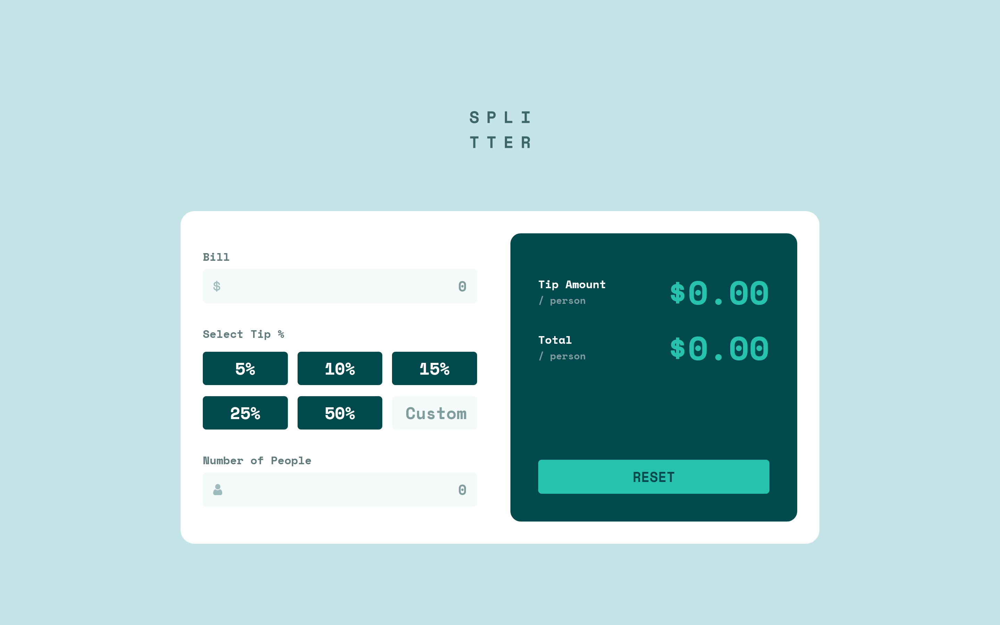
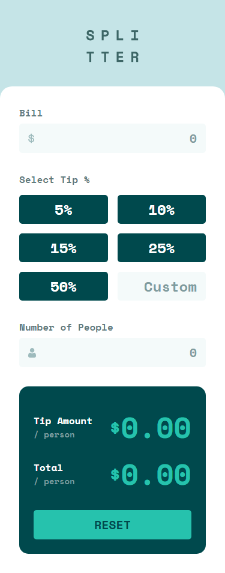

# Splitter

[Link to app](https://venusy.github.io/splitter/)

Splitter is a tip calculator app designed to help you divide tips and totals. 
It features a simple and intuitive user interface which is responsive and 
works across a large range of viewport sizes.

This app was built with React and CSS.

## Why I Built This Project

I built this project as an entry into the world of React. I wanted to build a 
functional app that required user input as I wanted to gain familiarity with 
the React concept of 'controlled components', as well as just a basic
understanding of React and its syntax.

## Preview

### Desktop Preview

### Mobile Preview

